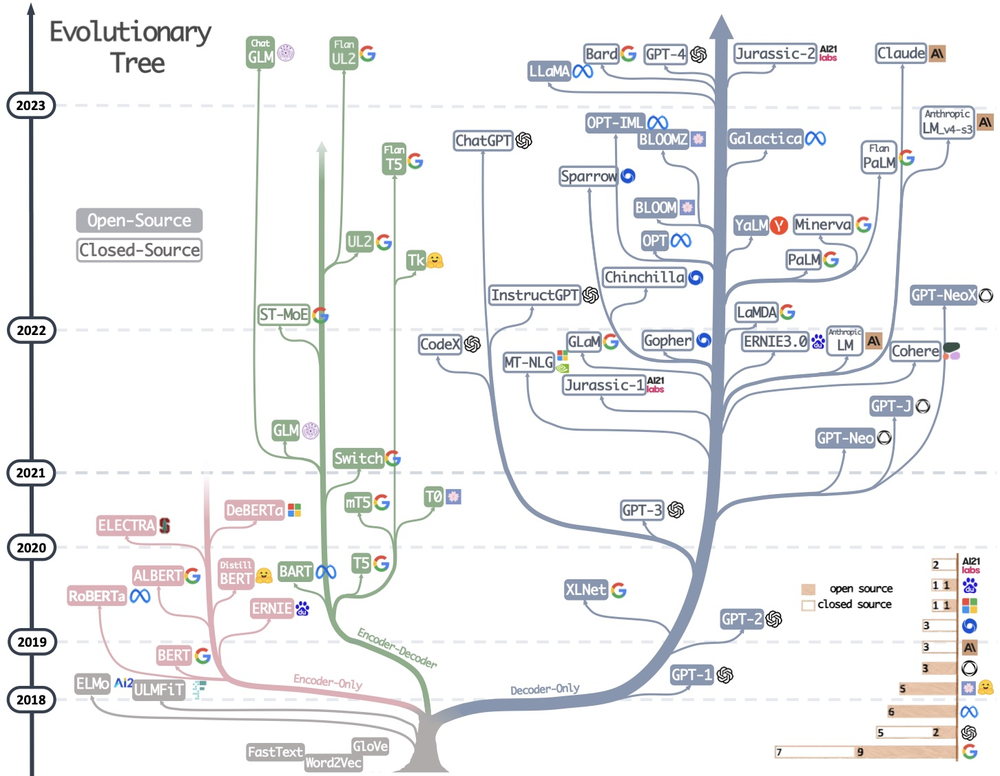
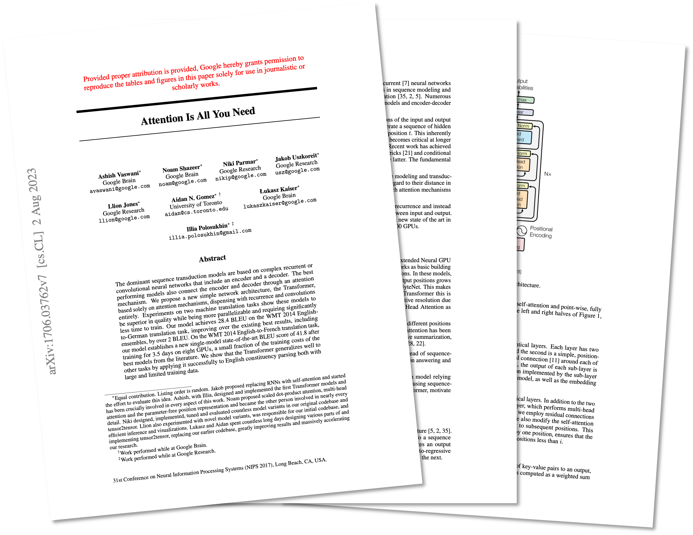
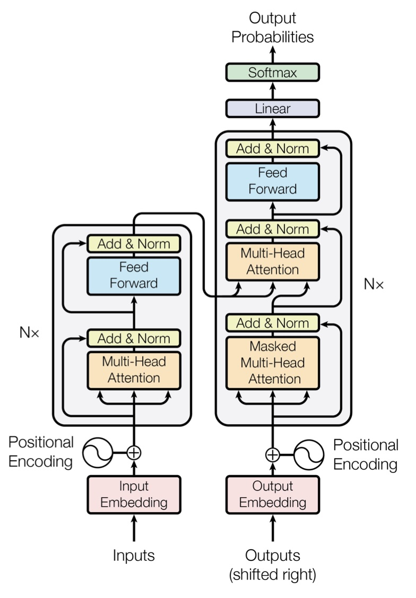
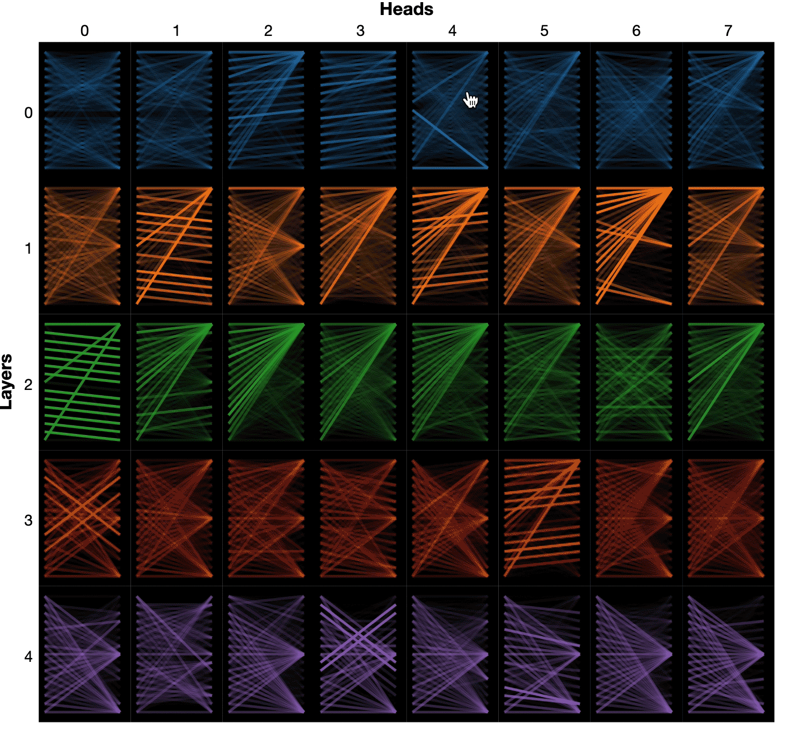
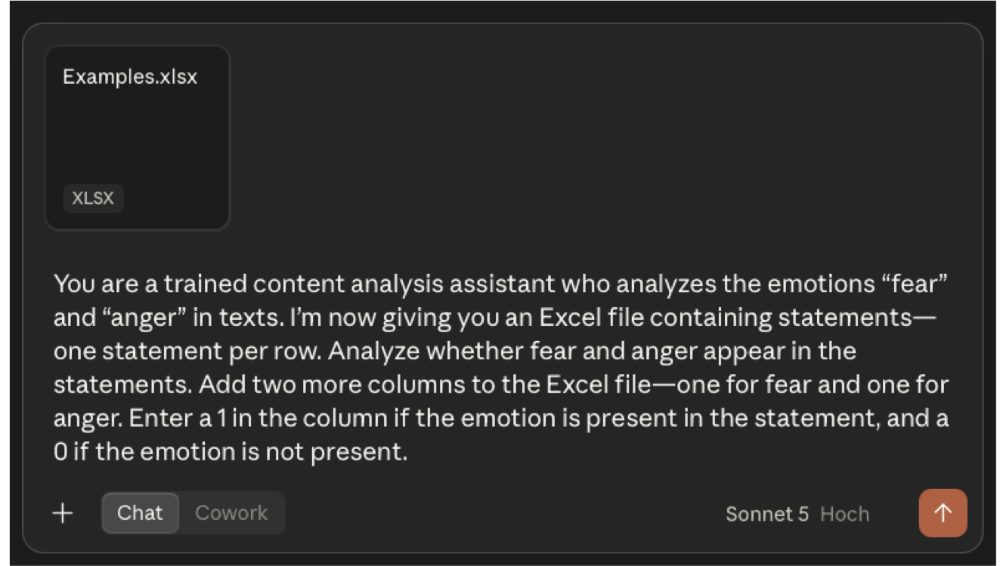

## Welcome!

- Use the arrow keys to navigate
- Press `M` to open the slide menu
- Press `?` to see all navigation shortcuts
- This deck and all other materials are at the course website

# LLMs in Content Analysis

{.divider-img}

## Introducing LLMs

> "Language models are **statistical representations of natural language** that use **machine learning to model relationships between words**. They can perform tasks such as **text classification** (e.g., whether the sentiment of a text is positive or negative) and contextual **text prediction** (i.e., what words are likely to follow other words) […] What makes LLMs large then is the **sheer amount of input data** used to construct them"
> 
> [@gruberLargeLanguageModels2025]

## Introducing LLMs

{width="70%"}

::: {style="text-align: right;"}
[@yangHarnessingPowerLLMs2023, p. 3] <br>
*Note*: Already outdated
:::

## Under the Hood of LLMs: The Transformer Architecture

::: {.columns}

::: {.column width="50%"}
{width="62%"}

- Introduced by @vaswaniAttentionAllYou2017

::: {.fragment fragment-index=1}
- **Complex neural network architecture** for machine learning (originally for text translation)
- **Innovation**: How **language is represented and processed**
:::

::: {.callout-tip}
## Deep dive into the math and code behind Transformers?
@starmerTransformerNeuralNetworks2023; @smithCompleteGuideBERT2024; @turnerIntroductionTransformers2024
:::

:::

::: {.column width="50%" .fragment fragment-index=1}
{width="80%"}
:::

:::

## How Can Computers Represent Texts? {auto-animate="true"}

::: {.citation .below-heading}
[@kroonAdvancingAutomatedContent2024; @viehmannInvestigatingOpinionsPublic2023]
:::

::: {.columns}

::: {.column width="50%"}
Classical approach: **Bag-of-words**

- Words of a text are understood as isolated, discrete variables
- The order, context, or grammatical function of each word is ignored
:::

::: {.column width="50%"}
<div class="bow-figure">

<div class="bow-texts" data-id="bow-texts">
<div class="bow-text"><span class="bow-text-label">Text 1:</span>The Odyssey is great.</div>
<div class="bow-text"><span class="bow-text-label">Text 2:</span>The Odyssey is bad and not like Homer's Odyssey.</div>
</div>

</div>
:::

:::

## How Can Computers Represent Texts? {auto-animate="true"}

::: {.citation .below-heading}
[@kroonAdvancingAutomatedContent2024; @viehmannInvestigatingOpinionsPublic2023]
:::

::: {.columns}

::: {.column width="50%"}
Classical approach: **Bag-of-words**

- Words of a text are understood as isolated, discrete variables
- The order, context, or grammatical function of each word is ignored

- Procedure:

  1. Term-extraction: each word is identified
:::

::: {.column width="50%"}
<div class="bow-figure">

<div class="bow-texts" data-id="bow-texts">
<div class="bow-text"><span class="bow-text-label">Text 1:</span>The Odyssey is great.</div>
<div class="bow-text"><span class="bow-text-label">Text 2:</span>The Odyssey is bad and not like Homer's Odyssey.</div>
</div>

<div class="bow-arrow" data-id="bow-a1"></div>

<svg class="bow-sack-svg" data-id="wordbag" viewBox="0 0 300 300" width="290" height="200" role="img" aria-label="A bag of words">
<g fill="none" stroke="currentColor" stroke-linejoin="round">
<path d="M66 8 L234 8 L176 86 L124 86 Z" stroke-width="13"/>
<path d="M108 114 C74 132, 30 178, 24 218 C18 258, 60 288, 150 288 C240 288, 282 258, 276 218 C270 178, 226 132, 192 114 Z" stroke-width="11"/>
</g>
<g fill="currentColor" text-anchor="middle" font-family="Aleo, Georgia, serif">
<text x="130" y="158" font-size="16">great</text>
<text x="88" y="184" font-size="16">bad</text>
<text x="152" y="184" font-size="16">and</text>
<text x="210" y="184" font-size="30">The</text>
<text x="150" y="228" font-size="50">Odyssey</text>
<text x="79" y="256" font-size="26">is</text>
<text x="114" y="256" font-size="15">not</text>
<text x="155" y="256" font-size="16">like</text>
<text x="210" y="256" font-size="15">Homer's</text>
</g>
</svg>

</div>
:::

:::

## How Can Computers Represent Texts? {auto-animate="true"}

::: {.citation .below-heading}
[@kroonAdvancingAutomatedContent2024; @viehmannInvestigatingOpinionsPublic2023]
:::

::: {.columns}

::: {.column width="50%"}
Classical approach: **Bag-of-words**

- Words of a text are understood as isolated, discrete variables
- The order, context, or grammatical function of each word is ignored

- Procedure:

  1. Term-extraction: each word is identified
  2. A vector space model (e.g., a document-term matrix) is created
:::

::: {.column width="50%"}
<div class="bow-figure">

<div class="bow-texts" data-id="bow-texts">
<div class="bow-text"><span class="bow-text-label">Text 1:</span>The Odyssey is great.</div>
<div class="bow-text"><span class="bow-text-label">Text 2:</span>The Odyssey is bad and not like Homer's Odyssey.</div>
</div>

<div class="bow-arrow" data-id="bow-a1"></div>

<svg class="bow-sack-svg" data-id="wordbag" viewBox="0 0 300 300" width="290" height ="200" role="img" aria-label="A bag of words">
<g fill="none" stroke="currentColor" stroke-linejoin="round">
<path d="M66 8 L234 8 L176 86 L124 86 Z" stroke-width="13"/>
<path d="M108 114 C74 132, 30 178, 24 218 C18 258, 60 288, 150 288 C240 288, 282 258, 276 218 C270 178, 226 132, 192 114 Z" stroke-width="11"/>
</g>
<g fill="currentColor" text-anchor="middle" font-family="Aleo, Georgia, serif">
<text x="130" y="158" font-size="16">great</text>
<text x="88" y="184" font-size="16">bad</text>
<text x="152" y="184" font-size="16">and</text>
<text x="210" y="184" font-size="30">The</text>
<text x="150" y="228" font-size="50">Odyssey</text>
<text x="79" y="256" font-size="26">is</text>
<text x="114" y="256" font-size="15">not</text>
<text x="155" y="256" font-size="16">like</text>
<text x="210" y="256" font-size="15">Homer's</text>
</g>
</svg>

<div class="bow-arrow" data-id="bow-a2"></div>

<table class="dtm" data-id="bow-dtm">
<thead>
<tr><th></th><th>The</th><th>Odyssey</th><th>is</th><th>great</th><th>bad</th><th>and</th><th>not</th><th>like</th><th>Homer's</th></tr>
</thead>
<tbody>
<tr><td>Doc 1</td><td>1</td><td>1</td><td>1</td><td>1</td><td>0</td><td>0</td><td>0</td><td>0</td><td>0</td></tr>
<tr><td>Doc 2</td><td>1</td><td>2</td><td>1</td><td>0</td><td>1</td><td>1</td><td>1</td><td>1</td><td>1</td></tr>
</tbody>
</table>

</div>
:::

:::

## How Can Computers Represent Texts? {auto-animate="true"}

Two ways of turning that bag of words into a score:

<div class="bowa-figure">

<div class="bowa-row fragment fade-in-then-semi-out" data-fragment-index="1">
<div class="bowa-label">Dictionary-<br>based text<br>analysis</div>
<div class="bowa-icon"><svg class="bowa-pictogram" viewBox="0 0 104 104" role="img" aria-label="A researcher weighing up which words to include">
<circle cx="52" cy="52" r="46" fill="currentColor"/>
<path d="M25 33 C31 26, 44 26, 51 32" fill="none" stroke="var(--fig-paper)" stroke-width="5" stroke-linecap="round"/>
<ellipse cx="38" cy="48" rx="7" ry="9.5" fill="var(--fig-paper)"/>
<ellipse cx="68" cy="48" rx="7" ry="9.5" fill="var(--fig-paper)"/>
<path d="M35 77 C45 70, 60 71, 70 75" fill="none" stroke="var(--fig-paper)" stroke-width="5.5" stroke-linecap="round"/>
</svg></div>
<div class="bowa-arrow"></div>
<div class="bowa-icon">
<div class="bowa-icon-title">Dictionary</div>
<table class="dict-table">
<thead><tr><th>Word</th><th>Sentiment</th></tr></thead>
<tbody>
<tr><td>great</td><td>+1</td></tr>
<tr><td>bad</td><td>−1</td></tr>
<tr><td>like</td><td>+1</td></tr>
<tr><td>…</td><td>…</td></tr>
</tbody>
</table>
</div>
<div class="bowa-arrow"></div>
<table class="dtm-grid">
<thead>
<tr><th></th><th>The</th><th>Odyssey</th><th>is</th><th>great</th><th>bad</th><th>and</th><th>not</th><th>like</th><th>Homer's</th><th class="col-sep">sent.</th></tr>
</thead>
<tbody>
<tr><td>Doc 1</td><td>1</td><td>1</td><td>1</td><td class="cell-hit">1</td><td>0</td><td>0</td><td>0</td><td>0</td><td>0</td><td class="col-sep">+1</td></tr>
<tr><td>Doc 2</td><td>1</td><td>2</td><td>1</td><td>0</td><td class="cell-miss">1</td><td>1</td><td>1</td><td class="cell-hit">1</td><td>1</td><td class="col-sep">0</td></tr>
</tbody>
</table>
</div>

::: {.fragment .fade-in-then-semi-out .small-text fragment-index=1}
- **Dictionary-based text analysis:** A list of indicator words (*dictionary*) is created or used off-the-shelf and frequency of indicator words in documents is counted 
:::

<div class="bowa-row fragment fade-in-then-semi-out" data-fragment-index="2">
<div class="bowa-label">Supervised<br>Machine<br>Learning</div>
<div class="bowa-icon">
<div class="bowa-docs">
<div class="doc-labeled"><span>Label</span></div>
<div class="doc-labeled"><span>Label</span></div>
<div class="doc-labeled"><span>Label</span></div>
<div class="doc-labeled"><span>Label</span></div>
</div>
</div>
<div class="bowa-arrow"></div>
<div class="bowa-icon"><svg class="bowa-pictogram" viewBox="0 0 110 100" role="img" aria-label="A computer">
<rect x="12" y="4" width="86" height="60" rx="5" fill="var(--fig-paper)" stroke="currentColor" stroke-width="7"/>
<path d="M48 64 h14 v11 h-14 z" fill="currentColor"/>
<path d="M34 78 h42 c3 0 3 4 0 4 h-42 c-3 0 -3 -4 0 -4 z" fill="currentColor"/>
<path d="M8 86 h94 l-6 12 h-82 z" fill="currentColor"/>
<g fill="var(--fig-paper)">
<rect x="18" y="89" width="7" height="3"/><rect x="29" y="89" width="7" height="3"/>
<rect x="40" y="89" width="7" height="3"/><rect x="51" y="89" width="7" height="3"/>
<rect x="62" y="89" width="7" height="3"/><rect x="73" y="89" width="7" height="3"/>
<rect x="84" y="89" width="7" height="3"/>
<rect x="22" y="94" width="7" height="3"/><rect x="33" y="94" width="7" height="3"/>
<rect x="44" y="94" width="18" height="3"/><rect x="66" y="94" width="7" height="3"/>
<rect x="77" y="94" width="7" height="3"/>
</g>
</svg></div>
<div class="bowa-arrow"></div>
<div class="bowa-icon">
<div class="bowa-icon-title">Coding Rules</div>
<svg class="bowa-pictogram" viewBox="0 0 100 100" role="img" aria-label="A codebook">
<rect x="9" y="20" width="22" height="66" rx="4" fill="var(--fig-paper)" stroke="currentColor" stroke-width="6"/>
<rect x="27" y="12" width="64" height="74" rx="5" fill="var(--fig-paper)" stroke="currentColor" stroke-width="6"/>
<line x1="47" y1="15" x2="47" y2="83" stroke="currentColor" stroke-width="5"/>
</svg>
</div>
<div class="bowa-arrow"></div>
<table class="dtm-grid">
<thead>
<tr><th></th><th>The</th><th>Odyssey</th><th>is</th><th>great</th><th>bad</th><th>and</th><th>not</th><th>like</th><th>Homer's</th><th class="col-sep">sent.</th></tr>
</thead>
<tbody>
<tr><td>Doc 1</td><td>1</td><td>1</td><td>1</td><td>1</td><td>0</td><td>0</td><td>0</td><td>0</td><td>0</td><td class="col-sep">.89</td></tr>
<tr><td>Doc 2</td><td>1</td><td>2</td><td>1</td><td>0</td><td>1</td><td>1</td><td>1</td><td>1</td><td>1</td><td class="col-sep">−.25</td></tr>
</tbody>
</table>
</div>

</div>

::: {.fragment .fade-in-then-semi-out .small-text fragment-index=2}
- **Supervised Machine Learning:** Based on coded examples (*training data*), the computer 'learns' coding rules (typically, the statistical relationship between words and category values); learned rules are then applied to new material 
:::

::: {.fragment fragment-index=3}
**The problem:** Both treat words as isolated variables, ignore context, and only work with a pre-defined/trained vocabulary
:::

::: {.callout-tip}
## Interested in learning more about bag-of-words analysis?
**Basics**: @boumansTakingStockToolkit2016; @grimmerTextDataPromise2013. **Application in R**: @welbersTextAnalysis2017
:::

## How can computers represent texts? {auto-animate="true"}

::: {.citation .below-heading}
[@kroonAdvancingAutomatedContent2024]
:::

Accounting for the semantic (dis)similarity of words: **Word-embeddings**

::: {.incremental}
- Words are transformed into numerical vectors; similar words have similar vectors
- Idea: words that are used in similar contexts have a similar meaning
- *Transfer learning*: algorithms pre-trained on large corpora (e.g., *word2vec*) for new tasks
:::

<div class="embed-figure fragment">
<table class="heatmap" data-id="embed-matrix">
<thead><tr><th></th><th>Animacy</th><th>Gender</th><th>Age</th><th>Size</th><th>Humanness</th><th>Mechanical</th></tr></thead>
<tbody><tr><th>&ldquo;Boy&rdquo; &rarr;</th><td class="hm-b5">0.95</td><td class="hm-b3">0.70</td><td class="hm-r5">−0.80</td><td class="hm-r3">−0.60</td><td class="hm-b5">0.95</td><td class="hm-r5">−0.90</td></tr><tr><th>&ldquo;Man&rdquo; &rarr;</th><td class="hm-b5">0.95</td><td class="hm-b5">0.85</td><td class="hm-b2">0.30</td><td class="hm-b1">0.20</td><td class="hm-b5">0.95</td><td class="hm-r5">−0.90</td></tr><tr><th>&ldquo;Woman&rdquo; &rarr;</th><td class="hm-b5">0.95</td><td class="hm-r5">−0.85</td><td class="hm-b2">0.30</td><td class="hm-r1">0</td><td class="hm-b5">0.95</td><td class="hm-r5">−0.90</td></tr><tr><th>&ldquo;Bus&rdquo; &rarr;</th><td class="hm-r5">−0.90</td><td class="hm-r1">0</td><td class="hm-r1">0</td><td class="hm-b5">0.90</td><td class="hm-r5">−0.95</td><td class="hm-b5">0.95</td></tr></tbody>
</table>
</div>

## How can computers represent texts? {auto-animate="true"}

::: {.citation .below-heading}
[@kroonAdvancingAutomatedContent2024]
:::

Running a PCA on those vectors puts similar words close together in space:

<div class="embed-figure embed-figure-pca">
<table class="heatmap" data-id="embed-matrix">
<thead><tr><th></th><th>Animacy</th><th>Gender</th><th>Age</th><th>Size</th><th>Humanness</th><th>Mechanical</th></tr></thead>
<tbody><tr><th>&ldquo;Boy&rdquo; &rarr;</th><td class="hm-b5">0.95</td><td class="hm-b3">0.70</td><td class="hm-r5">−0.80</td><td class="hm-r3">−0.60</td><td class="hm-b5">0.95</td><td class="hm-r5">−0.90</td></tr><tr><th>&ldquo;Man&rdquo; &rarr;</th><td class="hm-b5">0.95</td><td class="hm-b5">0.85</td><td class="hm-b2">0.30</td><td class="hm-b1">0.20</td><td class="hm-b5">0.95</td><td class="hm-r5">−0.90</td></tr><tr><th>&ldquo;Woman&rdquo; &rarr;</th><td class="hm-b5">0.95</td><td class="hm-r5">−0.85</td><td class="hm-b2">0.30</td><td class="hm-r1">0</td><td class="hm-b5">0.95</td><td class="hm-r5">−0.90</td></tr><tr><th>&ldquo;Bus&rdquo; &rarr;</th><td class="hm-r5">−0.90</td><td class="hm-r1">0</td><td class="hm-r1">0</td><td class="hm-b5">0.90</td><td class="hm-r5">−0.95</td><td class="hm-b5">0.95</td></tr></tbody>
</table>
<div class="pca-note">&rarr;<br>If we<br>run a<br>PCA</div>
<svg class="pca-plot" viewBox="0 0 340 292" width="270" role="img" aria-label="PCA of the word vectors">
<rect x="10" y="6" width="326" height="280" fill="var(--fig-paper)" stroke="var(--fig-hairline)" stroke-width="1"/>
<g stroke="var(--fig-grid)" stroke-width="1" fill="none"><line x1="79.8" y1="20.0" x2="79.8" y2="252.0"/><line x1="134.4" y1="20.0" x2="134.4" y2="252.0"/><line x1="189.0" y1="20.0" x2="189.0" y2="252.0"/><line x1="243.6" y1="20.0" x2="243.6" y2="252.0"/><line x1="298.2" y1="20.0" x2="298.2" y2="252.0"/><line x1="58.0" y1="232.7" x2="320.0" y2="232.7"/><line x1="58.0" y1="194.0" x2="320.0" y2="194.0"/><line x1="58.0" y1="155.3" x2="320.0" y2="155.3"/><line x1="58.0" y1="116.7" x2="320.0" y2="116.7"/><line x1="58.0" y1="78.0" x2="320.0" y2="78.0"/><line x1="58.0" y1="39.3" x2="320.0" y2="39.3"/></g>
<rect x="58.0" y="20.0" width="262.0" height="232.0" fill="none" stroke="var(--fig-grid)" stroke-width="1"/>
<g font-size="12" fill="currentColor" font-family="Aleo, Georgia, serif"><text x="79.8" y="267" text-anchor="middle">-3</text><text x="134.4" y="267" text-anchor="middle">-2</text><text x="189.0" y="267" text-anchor="middle">-1</text><text x="243.6" y="267" text-anchor="middle">0</text><text x="298.2" y="267" text-anchor="middle">1</text><text x="52" y="236.7" text-anchor="end">-1.5</text><text x="52" y="198.0" text-anchor="end">-1.0</text><text x="52" y="159.3" text-anchor="end">-0.5</text><text x="52" y="120.7" text-anchor="end">0.0</text><text x="52" y="82.0" text-anchor="end">0.5</text><text x="52" y="43.3" text-anchor="end">1.0</text></g>
<circle cx="107.1" cy="108.9" r="7" fill="var(--gb-yellow)"/><circle cx="281.8" cy="93.5" r="7" fill="var(--gb-red)"/><circle cx="303.6" cy="58.7" r="7" fill="var(--gb-blue)"/><circle cx="284.5" cy="207.1" r="7" fill="var(--gb-aqua)"/>
<g font-size="13" fill="currentColor" font-family="Aleo, Georgia, serif"><text x="100.1" y="95.9" text-anchor="middle">Bus</text><text x="274.8" y="80.5" text-anchor="middle">Man</text><text x="296.6" y="45.7" text-anchor="middle">Boy</text><text x="277.5" y="194.1" text-anchor="middle">Woman</text></g>
<text x="189" y="284" text-anchor="middle" font-size="13" fill="currentColor" font-family="Aleo, Georgia, serif">PC1</text>
<text x="18" y="136" text-anchor="middle" font-size="13" fill="currentColor" font-family="Aleo, Georgia, serif" transform="rotate(-90 18 136)">PC2</text>
</svg>
</div>

- Word embeddings improve supervised machine learning, as computers can learn the relationship between position in the multidimensional word space and category values

::: {.callout-tip}
## Interested in learning more about word-embeddings?
@alammarIllustratedWord2vec; @rudkowskyMoreBagsWords2018
:::

## How can computers represent texts? {auto-animate="true"}

::: {.citation .below-heading}
[@kroonAdvancingAutomatedContent2024; @viehmannInvestigatingOpinionsPublic2023; @widmannCreatingComparingDictionary2023]
:::

- The **problem** with **word-embeddings**: each word is assigned only *one vector*, but the meaning of many words is context-dependent

<br>

::: {.columns}

::: {.column width="50%"}
::: {.fragment fragment-index=1}
<div class="dict-entry">
<div class="dict-entry-head">Bank (<em>bæŋk</em>) [noun]</div>
<div class="dict-entry-body">
<ol>
<li>an organization where people and businesses can invest or borrow money, change it to foreign money, etc., or a building where these services are offered</li>
<li>sloping raised land, especially along the sides of a river</li>
<li>a pile or mass of earth, clouds, etc.</li>
<li>a row of similar things, especially machines or parts of machines</li>
</ol>
</div>
<div class="dict-entry-source">(Cambridge University Press, n.d.)</div>
</div>
:::
:::

::: {.column width="50%"}
<div class="context-sentences">
<div class="fragment" data-fragment-index="2"><br>The bank raised my interest rate.</div>
<div class="fragment" data-fragment-index="3"><br>He was sitting by the banks of the river.</div>
<div class="fragment" data-fragment-index="4"><br>A thick bank of fog is rolling in from the north.</div>
</div>
:::

:::

<br>

::: {.fragment}
- Groundbreaking innovation of **Transformers**:<br>generating "contextualized word embeddings" [@kroonAdvancingAutomatedContent2024, p. 150] by determining how important each word in the context is to identify the meaning of a word (*self-attention*), in a particularly computationally efficient manner (*parallelization*)
:::

## Self-Attention Visualized



::: {.callout-tip}
## Give it a try yourself!
[BertViz Interactive Tutorial](https://colab.research.google.com/drive/1hXIQ77A4TYS4y3UthWF-Ci7V7vVUoxmQ?usp=sharing) [@vigMultiscaleVisualizationAttention2019]
:::

## From Transformers to LLMs {auto-animate="true"}

::: {.citation .below-heading}
[@demszkyUsingLargeLanguage2023; @minaeeLargeLanguageModels2024]
:::

::: {.incremental}
- Transformers can be **pre-trained** on large corpora for new tasks (*transfer learning*)
- **LLMs**: **generic** models trained using the Transformer architecture on **massive amounts of text**, possessing a **rich vocabulary** and good **"understanding"** of texts
- Basic model types:
  - **Encoder models** focused on text understanding (e.g., *BERT*)
  - **Decoder models** focused on text generation (e.g., *GPT-4*)
:::

<div class="pipeline pipeline-lg fragment">

<div class="pipe-corpus">
<div class="pipe-corpus-title">Large amounts of non-coded text as training data</div>
<div class="doc-grid" data-id="corpus">
<div class="doc-stack"></div>
<div class="doc-stack"></div>
<div class="doc-stack"></div>
<div class="doc-stack"></div>
<div class="doc-stack"></div>
<div class="doc-stack"></div>
<div class="doc-stack"></div>
<div class="doc-stack"></div>
<div class="doc-stack"></div>
<div class="doc-stack"></div>
<div class="doc-stack"></div>
<div class="doc-stack"></div>
</div>
</div>

<div class="pipe-arrow"></div>

<div class="pipe-card" data-id="tf-card">
<div class="pipe-card-title">Transformer Architecture</div>
<div class="tf-inner">
<div class="tf-input">This is a text input</div>
<div class="emb-group">
<div class="emb-col emb-light"><div class="emb-run"><div class="emb-cell"></div><div class="emb-cell"></div><div class="emb-cell"></div></div><div class="emb-run"><div class="emb-cell"></div><div class="emb-cell"></div><div class="emb-cell"></div></div><div class="emb-run"><div class="emb-cell"></div><div class="emb-cell"></div><div class="emb-cell"></div></div></div>
<div class="emb-label">Word-<br>Embedding</div>
</div>
<div class="tf-arrow"></div>
<div class="emb-group">
<div class="emb-col emb-dark"><div class="emb-run"><div class="emb-cell"></div><div class="emb-cell"></div><div class="emb-cell"></div></div><div class="emb-run"><div class="emb-cell"></div><div class="emb-cell"></div><div class="emb-cell"></div></div><div class="emb-run"><div class="emb-cell"></div><div class="emb-cell"></div><div class="emb-cell"></div></div></div>
<div class="emb-label">Position-<br>Embedding</div>
</div>
<div class="tf-arrow"></div>
<div class="layer-stack">
<div class="layer-ghost g2"></div>
<div class="layer-ghost g1"></div>
<div class="layer-card">
<div class="layer-block">Self-Attention</div>
<div class="layer-block">Neural Network</div>
</div>
</div>
</div>
</div>

<div class="pipe-arrow"></div>

<div class="pipe-card" data-id="llm-card">
<div class="pipe-card-title">Large Language<br>Model</div>
<div class="llm-box llm-box-encoder" data-id="fb-encoder">Generic<br>Encoder<br>Model</div>
<div class="llm-box llm-box-decoder" data-id="fb-decoder">Universal<br>Decoder<br>Model</div>
</div>

</div>


## LLMs in Content Analysis {auto-animate="true"}

::: {.citation .below-heading}
[@demszkyUsingLargeLanguage2023; @kroonAdvancingAutomatedContent2024; @viehmannInvestigatingOpinionsPublic2023]
:::

<div class="pipeline">

<div class="pipe-corpus">
<div class="pipe-corpus-title">Large amounts of non-coded text as training data</div>
<div class="doc-grid" data-id="corpus">
<div class="doc-stack"></div>
<div class="doc-stack"></div>
<div class="doc-stack"></div>
<div class="doc-stack"></div>
<div class="doc-stack"></div>
<div class="doc-stack"></div>
<div class="doc-stack"></div>
<div class="doc-stack"></div>
<div class="doc-stack"></div>
<div class="doc-stack"></div>
<div class="doc-stack"></div>
<div class="doc-stack"></div>
</div>
</div>

<div class="pipe-arrow"></div>

<div class="pipe-card" data-id="tf-card">
<div class="pipe-card-title">Transformer Architecture</div>
<div class="tf-inner">
<div class="tf-input">This is a text input</div>
<div class="emb-group">
<div class="emb-col emb-light"><div class="emb-run"><div class="emb-cell"></div><div class="emb-cell"></div><div class="emb-cell"></div></div><div class="emb-run"><div class="emb-cell"></div><div class="emb-cell"></div><div class="emb-cell"></div></div><div class="emb-run"><div class="emb-cell"></div><div class="emb-cell"></div><div class="emb-cell"></div></div></div>
<div class="emb-label">Word-<br>Embedding</div>
</div>
<div class="tf-arrow"></div>
<div class="emb-group">
<div class="emb-col emb-dark"><div class="emb-run"><div class="emb-cell"></div><div class="emb-cell"></div><div class="emb-cell"></div></div><div class="emb-run"><div class="emb-cell"></div><div class="emb-cell"></div><div class="emb-cell"></div></div><div class="emb-run"><div class="emb-cell"></div><div class="emb-cell"></div><div class="emb-cell"></div></div></div>
<div class="emb-label">Position-<br>Embedding</div>
</div>
<div class="tf-arrow"></div>
<div class="layer-stack">
<div class="layer-ghost g2"></div>
<div class="layer-ghost g1"></div>
<div class="layer-card">
<div class="layer-block">Self-Attention</div>
<div class="layer-block">Neural Network</div>
</div>
</div>
</div>
</div>

<div class="pipe-arrow"></div>

<div class="pipe-card" data-id="llm-card">
<div class="pipe-card-title">Large Language<br>Model</div>
<div class="llm-box llm-box-encoder" data-id="fb-encoder">Generic<br>Encoder<br>Model</div>
<div class="llm-box llm-box-decoder" data-id="fb-decoder">Universal<br>Decoder<br>Model</div>
</div>

<div class="pipe-out">

<div class="out-row">
<div class="out-data">
<div class="out-data-title">Category-specific<br>training data<br><em>(e.g., coded for tonality)</em></div>
<div class="doc-pair">
<div class="doc-labeled"><span>Label</span></div>
<div class="doc-labeled"><span>Label</span></div>
</div>
</div>
<div class="out-arrow-short"></div>
<div class="out-arrow-long"></div>
<div class="out-box" data-id="ob-cat">Category-Specific<br>Encoder Model</div>
</div>

</div>

</div>

<br>

**Category-specific encoder models**

::: {.incremental}
- *Fine-tuning* a generic encoder model to code a specific category (e.g., tonality) using manually coded texts as training material
- Because of its "language knowledge," training works faster and with smaller amounts of data than classical machine-learning approaches
- The model can then code that one, specific category
:::

## LLMs in Content Analysis {auto-animate="true"}

::: {.citation .below-heading}
[@laurerLessAnnotatingMore2024; @laurerBuildingEfficientUniversal2024]
:::

<div class="pipeline">

<div class="pipe-corpus">
<div class="pipe-corpus-title">Large amounts of non-coded text as training data</div>
<div class="doc-grid" data-id="corpus">
<div class="doc-stack"></div>
<div class="doc-stack"></div>
<div class="doc-stack"></div>
<div class="doc-stack"></div>
<div class="doc-stack"></div>
<div class="doc-stack"></div>
<div class="doc-stack"></div>
<div class="doc-stack"></div>
<div class="doc-stack"></div>
<div class="doc-stack"></div>
<div class="doc-stack"></div>
<div class="doc-stack"></div>
</div>
</div>

<div class="pipe-arrow"></div>

<div class="pipe-card" data-id="tf-card">
<div class="pipe-card-title">Transformer Architecture</div>
<div class="tf-inner">
<div class="tf-input">This is a text input</div>
<div class="emb-group">
<div class="emb-col emb-light"><div class="emb-run"><div class="emb-cell"></div><div class="emb-cell"></div><div class="emb-cell"></div></div><div class="emb-run"><div class="emb-cell"></div><div class="emb-cell"></div><div class="emb-cell"></div></div><div class="emb-run"><div class="emb-cell"></div><div class="emb-cell"></div><div class="emb-cell"></div></div></div>
<div class="emb-label">Word-<br>Embedding</div>
</div>
<div class="tf-arrow"></div>
<div class="emb-group">
<div class="emb-col emb-dark"><div class="emb-run"><div class="emb-cell"></div><div class="emb-cell"></div><div class="emb-cell"></div></div><div class="emb-run"><div class="emb-cell"></div><div class="emb-cell"></div><div class="emb-cell"></div></div><div class="emb-run"><div class="emb-cell"></div><div class="emb-cell"></div><div class="emb-cell"></div></div></div>
<div class="emb-label">Position-<br>Embedding</div>
</div>
<div class="tf-arrow"></div>
<div class="layer-stack">
<div class="layer-ghost g2"></div>
<div class="layer-ghost g1"></div>
<div class="layer-card">
<div class="layer-block">Self-Attention</div>
<div class="layer-block">Neural Network</div>
</div>
</div>
</div>
</div>

<div class="pipe-arrow"></div>

<div class="pipe-card" data-id="llm-card">
<div class="pipe-card-title">Large Language<br>Model</div>
<div class="llm-box llm-box-encoder" data-id="fb-encoder">Generic<br>Encoder<br>Model</div>
<div class="llm-box llm-box-decoder" data-id="fb-decoder">Universal<br>Decoder<br>Model</div>
</div>

<div class="pipe-out">

<div class="out-row">
<div class="out-data">
<div class="out-data-title">Category-specific<br>training data<br><em>(e.g., coded for tonality)</em></div>
<div class="doc-pair">
<div class="doc-labeled"><span>Label</span></div>
<div class="doc-labeled"><span>Label</span></div>
</div>
</div>
<div class="out-arrow-short"></div>
<div class="out-arrow-long"></div>
<div class="out-box" data-id="ob-cat">Category-Specific<br>Encoder Model</div>
</div>

<div class="out-row">
<div class="out-data">
<div class="out-data-title">Task-specific<br>training data<br><em>(e.g., NLI-Data)</em></div>
<div class="doc-pair">
<div class="doc-labeled"><span>Task</span></div>
<div class="doc-labeled"><span>Task</span></div>
</div>
</div>
<div class="out-arrow-short"></div>
<div class="out-arrow-long"></div>
<div class="out-box" data-id="ob-task">Task-Specific<br>Encoder Model</div>
</div>

</div>

</div>

<br>

**Task-specific encoder models**

::: {.incremental}
- *Fine-tuning* a generic encoder model for the general *task* of classifying texts, using general task data (e.g., from the NLI task) as training material
- The model can code (almost) anything, as long as the input follows the task's specifics
:::

## Short Excurse: The NLI Task

::: {.citation .below-heading}
[@laurerLessAnnotatingMore2024; @laurerBuildingEfficientUniversal2024]
:::

::: {.incremental}
- Classical task from machine learning
- Determining whether a source text (*premise*) and a statement about it (*hypothesis*) are (1) true, (2) false, or (3) neutral in relation to each other
:::

<div class="nli-figure fragment">
<div class="nli-head">Premise</div>
<div></div>
<div class="nli-head">Hypothesis</div>
<div class="nli-premise">&ldquo;The film is terribly directed and artistically unambitious.&rdquo;</div>
<div class="nli-rel nli-rel-false">false</div>
<div class="nli-hypothesis">&ldquo;The movie is good.&rdquo;</div>
<div class="nli-rel nli-rel-true">true</div>
<div class="nli-hypothesis">&ldquo;The movie is bad.&rdquo;</div>
<div class="nli-rel nli-rel-neutral">neutral</div>
<div class="nli-hypothesis">&ldquo;The movie is brand new.&rdquo;</div>
</div>


## LLMs in Content Analysis {auto-animate="true"}

::: {.citation .below-heading}
[@demszkyUsingLargeLanguage2023]
:::

<div class="pipeline">

<div class="pipe-corpus">
<div class="pipe-corpus-title">Large amounts of non-coded text as training data</div>
<div class="doc-grid" data-id="corpus">
<div class="doc-stack"></div>
<div class="doc-stack"></div>
<div class="doc-stack"></div>
<div class="doc-stack"></div>
<div class="doc-stack"></div>
<div class="doc-stack"></div>
<div class="doc-stack"></div>
<div class="doc-stack"></div>
<div class="doc-stack"></div>
<div class="doc-stack"></div>
<div class="doc-stack"></div>
<div class="doc-stack"></div>
</div>
</div>

<div class="pipe-arrow"></div>

<div class="pipe-card" data-id="tf-card">
<div class="pipe-card-title">Transformer Architecture</div>
<div class="tf-inner">
<div class="tf-input">This is a text input</div>
<div class="emb-group">
<div class="emb-col emb-light"><div class="emb-run"><div class="emb-cell"></div><div class="emb-cell"></div><div class="emb-cell"></div></div><div class="emb-run"><div class="emb-cell"></div><div class="emb-cell"></div><div class="emb-cell"></div></div><div class="emb-run"><div class="emb-cell"></div><div class="emb-cell"></div><div class="emb-cell"></div></div></div>
<div class="emb-label">Word-<br>Embedding</div>
</div>
<div class="tf-arrow"></div>
<div class="emb-group">
<div class="emb-col emb-dark"><div class="emb-run"><div class="emb-cell"></div><div class="emb-cell"></div><div class="emb-cell"></div></div><div class="emb-run"><div class="emb-cell"></div><div class="emb-cell"></div><div class="emb-cell"></div></div><div class="emb-run"><div class="emb-cell"></div><div class="emb-cell"></div><div class="emb-cell"></div></div></div>
<div class="emb-label">Position-<br>Embedding</div>
</div>
<div class="tf-arrow"></div>
<div class="layer-stack">
<div class="layer-ghost g2"></div>
<div class="layer-ghost g1"></div>
<div class="layer-card">
<div class="layer-block">Self-Attention</div>
<div class="layer-block">Neural Network</div>
</div>
</div>
</div>
</div>

<div class="pipe-arrow"></div>

<div class="pipe-card" data-id="llm-card">
<div class="pipe-card-title">Large Language<br>Model</div>
<div class="llm-box llm-box-encoder" data-id="fb-encoder">Generic<br>Encoder<br>Model</div>
<div class="llm-box llm-box-decoder" data-id="fb-decoder">Universal<br>Decoder<br>Model</div>
</div>

<div class="pipe-out">

<div class="out-row">
<div class="out-data">
<div class="out-data-title">Category-specific<br>training data<br><em>(e.g., coded for tonality)</em></div>
<div class="doc-pair">
<div class="doc-labeled"><span>Label</span></div>
<div class="doc-labeled"><span>Label</span></div>
</div>
</div>
<div class="out-arrow-short"></div>
<div class="out-arrow-long"></div>
<div class="out-box" data-id="ob-cat">Category-Specific<br>Encoder Model</div>
</div>

<div class="out-row">
<div class="out-data">
<div class="out-data-title">Task-specific<br>training data<br><em>(e.g., NLI-Data)</em></div>
<div class="doc-pair">
<div class="doc-labeled"><span>Task</span></div>
<div class="doc-labeled"><span>Task</span></div>
</div>
</div>
<div class="out-arrow-short"></div>
<div class="out-arrow-long"></div>
<div class="out-box" data-id="ob-task">Task-Specific<br>Encoder Model</div>
</div>

<div class="out-row out-row-plain">
<div class="out-arrow-long"></div>
<div class="out-box" data-id="ob-dec">Universal<br>Decoder Model</div>
</div>

</div>

</div>

<br>

**Universal decoder models**

::: {.incremental}
- Use the model's ability to generate plausible text directly for coding — no fine-tuning needed
- Receive the text and the coding instructions as a prompt (*prompt tuning*): with examples (*few-shot*) or without (*zero-shot*)
- Can code (almost) anything
:::

## LLMs in Content Analysis {auto-animate="true"}

Given their different approaches and training, the different models produce different outputs for the same input text — *"The film is terribly directed and artistically unambitious."*

<div class="io-figure">

<div class="io-head">Input</div>
<div></div>
<div class="io-head">Model</div>
<div></div>
<div class="io-head">Output</div>

<div class="io-in fragment" data-fragment-index="1">
<div><strong>Text:</strong>&ldquo;The film is terribly directed and artistically unambitious.&rdquo;</div>
</div>
<div class="io-arrows fragment" data-fragment-index="1">
<div class="io-arrow"></div>
</div>
<div class="io-model fragment" data-fragment-index="1">Category-specific<br>Encoder Model<span>(In this example: trained to code sentiment)</span></div>
<div class="io-arrows fragment" data-fragment-index="1">
<div class="io-arrow"></div>
</div>
<div class="io-out fragment" data-fragment-index="1">Positive: 0.02<br>Negative: 0.97<br>Neutral: 0.01</div>

<div class="io-sep fragment" data-fragment-index="2"></div>

<div class="io-in fragment" data-fragment-index="2">
<div><strong>Text:</strong>&ldquo;The film is terribly directed and artistically unambitious.&rdquo;</div>
<div><strong>Hypothesis:</strong>&ldquo;The tone of the text is negative.&rdquo;</div>
</div>
<div class="io-arrows fragment" data-fragment-index="2">
<div class="io-arrow"></div>
<div class="io-arrow"></div>
</div>
<div class="io-model fragment" data-fragment-index="2">Task-specific<br>Encoder Model<span>(In this example: trained for the NLI task)</span></div>
<div class="io-arrows fragment" data-fragment-index="2">
<div class="io-arrow"></div>
</div>
<div class="io-out fragment" data-fragment-index="2">True: 0.86<br>Wrong: 0.10<br>Neutral: 0.04</div>

<div class="io-sep fragment" data-fragment-index="3"></div>

<div class="io-in fragment" data-fragment-index="3">
<div><strong>Text:</strong>&ldquo;The film is terribly directed and artistically unambitious.&rdquo;</div>
<div><strong>Prompt:</strong>&ldquo;Is this text negative, positive, or neutral?&rdquo;</div>
</div>
<div class="io-arrows fragment" data-fragment-index="3">
<div class="io-arrow"></div>
<div class="io-arrow"></div>
</div>
<div class="io-model fragment" data-fragment-index="3">Universal<br>Decoder Model</div>
<div class="io-arrows fragment" data-fragment-index="3">
<div class="io-arrow"></div>
</div>
<div class="io-out fragment" data-fragment-index="3">&ldquo;The text is negative because it contains words that express negative evaluations.&rdquo;</div>

</div>

# How to Access the Power of LLMs for Text Analysis

{.divider-img}

## Can I Train my Own LLM?

- Well, you could — but training and/or fine-tuning an LLM is *very* resource-demanding

::: {.fragment}
::: {.callout-tip title="Example: Llama 3"}
- 15 trillion tokens (words)
- 7.7 million GPU-hours
- 2,290 tons of CO₂-equivalent emissions <br>(≈ 587 trips Luxembourg–Tokyo of one person in a B787 ✈️)
<br><br>[@grattafioriLlama3Herd2024; @aimetaMetallamaMetaLlama370BHugging2024]
:::
:::

::: {.fragment}
- Thus, LLMs can be understood as a research infrastructure

> **Research infrastructure**: "Tools and institutions available to all members of the respective scientific community to support their research" [@wissenschaftsratEmpfehlungenForschungsinfrastrukturenGeistes2011, p. 13]
:::

## Commercial LLMs {.smaller}

::: {.citation .below-heading}
[@demszkyUsingLargeLanguage2023]
:::

:::: {.columns}

::: {.column .fragment width="40%"}
Interact with LLMs either via chatbots...



::: {.callout-important}

# Warning
Chatbots do not allow you to code text by text (i.e., loop over the corpus) but rather code the whole batch. This quickly becomes problematic due to the context window (e.g., limited, carry over effects, etc.).

:::

:::


::: {.column .fragment width="60%"}

or using their API (application programming interface).
```{r}
#| eval: false
#| echo: true
library(ellmer)

text_input <- "It's getting worse every year. COME ON MERZ, DO SOMETHING!!!"

chat <- chat_google_gemini(
  api_key = key,
  model = "gemini-3.6-flash",
  system_prompt = "You are a good research assistant and your job is to annotate texts",
  echo = "output"
)

chat$chat_structured(
  text_input,
  type = type_object(
    fear = type_string("choose between: mentioned, not mentioned"),
    anger = type_string("choose between: mentioned, not mentioned")
  )
)
```
:::

::::

::: {.columns}

::: {.column width="40%"}

::: {.incremental}
- Typically most powerful<br>[(but Chinese open-source models are catching up fast)]{.small-text}
- No worry about computational needs
- No technical expertise required<br>[(especially when using chatbots)]{.small-text}
:::
:::

::: {.column width="60%"}
::: {.incremental}
- **But** it can quickly become very costly
- **But** low reproducibility, as the models get updated quickly
- **But** often not very transparent
- **But** severe data-security issues (good luck getting IRB approval)
- **But** only universal decoder models available<br>[(i.e., using a sledgehammer to crack a nut)]{.small-text}
:::
:::
:::

## Open Source LLMs

::: {.citation .below-heading}
[@demszkyUsingLargeLanguage2023]
:::

Download publicly available LLMs, or use a server to run them online

::: {.columns}

::: {.column width="45%"}

::: {.incremental}
- A wide range of models available (including quicker & smaller encoder models)
- Eases reproducibility (you download and store the exact model you used)
- Good data security, as everything runs locally / on your own infrastructure<br>[(your IRB likes that)]{.small-text}
- More control means room for customization and testing
:::
:::

::: {.column width="9%"}
:::

::: {.column width="45%"}
::: {.incremental}
- **But** computing power for running complex models can quickly become costly
- **But** you need a little more expertise<br>(we'll help you with that today)
- **But** models can be less powerful [(but again, Chinese open-source models are catching up fast)]{.small-text}
:::
:::
:::

## How to Best Access Open Source LLMs

::: {.citation .below-heading}
*Note*: these are just prototypical solutions — things can be more complicated in practice.
:::

Three decisions to make — and they are largely independent of each other

::::::: {.flip-deck}

::::: {.flip-card .fragment fragment-index=1}
:::: {.flip-inner}

::: {.flip-front}
[1 — Model storage]{.flip-step}

[📦]{.flip-icon}

[Where does the model come from?]{.flip-lead}

Open weights are published on **model hubs**. You download the exact version you need — and can archive it, which is what makes your analysis reproducible.
:::

::: {.flip-back}
[1 — Model storage]{.flip-step}

- **Hugging Face** — the de-facto standard: weights, datasets, model cards, and the code to load them
- **Ollama** keeps its own curated library of models for local use
- Alternatives (Kaggle, ModelScope, …) exist, but are far smaller
:::

::::
:::::

::::: {.flip-card .fragment fragment-index=2}
:::: {.flip-inner}

::: {.flip-front}
[2 — Running the model]{.flip-step}

[⚙️]{.flip-icon}

[Whose hardware does the computing?]{.flip-lead}

Somewhere, a **GPU (or CPU) has to do the work**. The options trade control and data security against convenience and cost.
:::

::: {.flip-back}
[2 — Running the model]{.flip-step}

- **Locally**: `transformers`, **Ollama** — best data security, but limited to smaller models
- **On a GPU server**: anything that runs Python — **Google Colab**, your university's cluster
- **Via a cloud API**: **Replicate**, **Chat AI** (GWDG) — no hardware needed, pay per use
:::

::::
:::::

::::: {.flip-card .fragment fragment-index=3}
:::: {.flip-inner}

::: {.flip-front}
[3 — Interacting]{.flip-step}

[💬]{.flip-icon}

[How do you send texts and get labels back?]{.flip-lead}

For content analysis you need to **loop over your corpus in a script** rather than chat — so you drive the model from `R` or `Python`.
:::

::: {.flip-back}
[3 — Interacting]{.flip-step}

- **Python**: `transformers` — load and run models directly
- **R**: `ellmer` — one interface for Ollama and cloud APIs; [`klaus`](https://github.com/cbpuschmann/klaus) for Chat AI (GWDG)
- **Chatbot interfaces**: fine for exploring, unsuited for reproducible coding
:::

::::
:::::

:::::::

::: {.flip-hint}
Click a card to see the concrete software
:::


# The Platform Hugging Face

::: {.section-emoji .divider-img}
🤗
:::

## Hugging Face: The Largest Model Hub

::: {.citation .below-heading}
[@zhaoModelsAreCodes2024, p. 2089]
:::

::: {.columns}

::: {.column width="50%"}
::: {.hub-table}

| Model hub | # Models | # Datasets | Distribution |
|---|---:|---:|---|
| **Hugging Face** | 752,269 | 174,226 | Hub APIs, Git |
| Spark NLP | 41,346 | – | Hub APIs, Download |
| OpenCSG | 26,187 | 327 | Git |
| Kaggle | 5,932 | 355,251 | Hub APIs, Download |
| ModelScope | 5,749 | 2,302 | Hub APIs, Git |
| ModelZoo | 3,245 | – | Git |
| OpenMMLab | 2,404 | – | Git |
| ONNX Model Zoo | 1,720 | – | Git |
| NVIDIA NGC | 759 | – | CLI, Download |
| MindSpore | 706 | 390 | Git, Download |
| WiseModel | 624 | 524 | Git |
| PaddlePaddle | 272 | 10,000 | Git |
| SwanHub | 269 | – | Git |
| Liandanxia | 264 | 381 | Git |
| PyTorch Hub | 52 | – | Hub APIs, Git |

:::

:::

::: {.column width="7%"}
:::

::: {.column width="42%"}
HuggingFace as the central platform for:

- developing LLMs
- sharing ready-to-use LLMs
- using shared LLMs
:::

:::

## HuggingFace as Infrastructure

{width="80%"}

::: {.callout-tip}
## Let's take a look
[huggingface.co](https://huggingface.co/)
:::

## HuggingFace as Infrastructure

{width="80%"}

- Models are shared on the platform
- Model cards report on their composition and background

::: {.fragment}
::: {.callout-warning}
- Not all models are transparently documented [@pepeHowHuggingFace2024]
- While all models are checked for security, some vulnerabilities exist [@zhaoModelsAreCodes2024]
- The platform has strong gatekeeping power [@gorwaModeratingModelMarketplaces2024]
:::
:::

## HuggingFace as Infrastructure

The Python package `transformers` allows easy access, download, and usage of LLMs from the repository — models can be used locally in a few lines of code:

:::smaller
::: {.small-text}
`text = "The film is terribly directed and artistically unambitious."`
:::

:::columns
:::{.column width="40%"}

::: {.fragment}
**Category-specific encoder**

```python
from transformers import pipeline

classifier = pipeline("sentiment-analysis",
                       model="oliverguhr/german-sentiment-bert")
classifier(text)
# [{'label': 'neutral', 'score': 0.9986}]
```
:::

:::

:::{.column width="60%"}

::: {.fragment}
**Task-specific (NLI) encoder**

```python
from transformers import pipeline

classifier = pipeline("zero-shot-classification",
                       model="MoritzLaurer/bge-m3-zeroshot-v2.0")
classifier(text, hypothesis_template="The tone of the text is {}",
           candidate_labels=["positive", "neutral", "negative"])
# {'labels': ['negative', 'neutral', 'positive'],
#  'scores': [0.733, 0.260, 0.007]}
```
:::

:::
:::

::: {.fragment}
**Universal decoder**

```python
from transformers import pipeline

classifier = pipeline("text-generation",
                       model="meta-llama/Meta-Llama-3.1-8B-Instruct")
prompt = [{"role": "system", "content": "Is this text negative, positive, or neutral?"},
          {"role": "user", "content": text}]
classifier(prompt, max_new_tokens=50, do_sample=False)
# "This text is negative. The author criticizes the film as
#  'terribly directed' and 'artistically unambitious'."
```
:::
:::

# References {.scrollable}

::: {#refs}
:::
